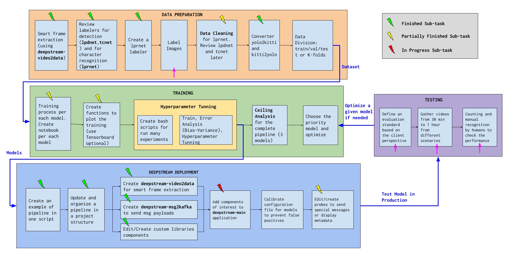
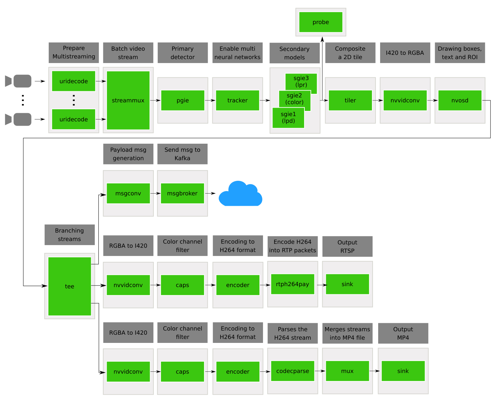

# Automatic License Plate Recognition (Nvidia TAO + Deepstream  Application + Python Bindings)

[**Project Page**](https://zosov.github.io/portfolio/lpr/)

This repository contains a entire process for developing an Automatic License 
Plate Recognition (ALPR) system using mainly [Nvidia TAO Toolkit](https://developer.nvidia.com/tao-toolkit)
and [Nvidia Deepstream SDK](https://developer.nvidia.com/deepstream-sdk) using the [Python Bindings](https://github.com/NVIDIA-AI-IOT/deepstream_python_apps).

The repository is divided into four modules to solve specific sub-tasks of 
the system. The following diagram summarizes the whole process. The work is in 
progress, so you can find the workflow updates [[here]](https://docs.google.com/drawings/d/10wA3cKPuyulc_6MCku48vwxPMXjcMIJ8FYxaL-rTzOM/edit?usp=sharing)



1. **Data Preparation**: This module comprises the following tasks: labeler creation, labeling data, cleaning data, format conversion, and data division, among others. To know more about this module, refer to  [data_preparation](./data_preparation/)

2. **Training**: This module comprises the following tasks: training models, training visualization,
hyperparameter tuning, and ceiling analysis. To know more about this module, refer to  [training](./training).

    Note that here we have to train three different models, which are

    - `tcnet`: Traffic Cam is a neural network to detect cars. More details [[here]](https://catalog.ngc.nvidia.com/orgs/nvidia/teams/tao/models/trafficcamnet)
    - `lpdnet`: License Plate Detection is a neural network to detect license plates. More details [[here]](https://catalog.ngc.nvidia.com/orgs/nvidia/teams/tao/models/lpdnet)
    - `lprnet`: License Plate Recognition is a neural network to recognize characters from a license plate. More details [[here]](https://catalog.ngc.nvidia.com/orgs/nvidia/models/tlt_lprnet).

    The idea is that these models will be used in a cascade style in the pipeline to detect cars, then detect a plate and finally recognize the characters. 

3. **Deployment**: This module comprises the creation of the main pipeline in [deployment/deepstream-main/](./deployment/deepstream-main/), which includes a multistreaming process, a saving option in MP4, and a process to send messages to a Kafka broker. To know more about this module, refer to  [deployment](./deployment). 

    In the following, we can see the main pipeline create on [deployment/deepstream-main/](./deployment/deepstream-main/)

    


    Although our main application contains all the components for deployment, we include some additional utils application [deployment/deepstream-video2data/](./deployment/deepstream-video2data/) and [deployment/deepstream-msg2kafka/](./deployment/deepstream-msg2kafka/), which allow us to execute some specific helpful process for our development.

4. **Testing**: (In progress) This module contains the main scripts and notebooks to execute a clear testing in production.


### Script formatting

In order to follow the [PEP8](pep8.org), we use the [pre-commit](pre-commit.com) hook scripts. Next, we present the steps to run them.

* Create or activate a conda environment.
```
conda create -n <name>
conda activate <name>
```

* Ensure to have pip and upgraded
```
conda install pip
conda config --add channels conda-forge 
conda update pip
```

* Install pre-commit.

```
pip install pre-commit
```

* Use pre-commit command.
```
pre-commit run --files <path/to/script.py>
```

* The configuration file is [`.pre-commit-config.yaml`](.pre-commit-config.yaml).
