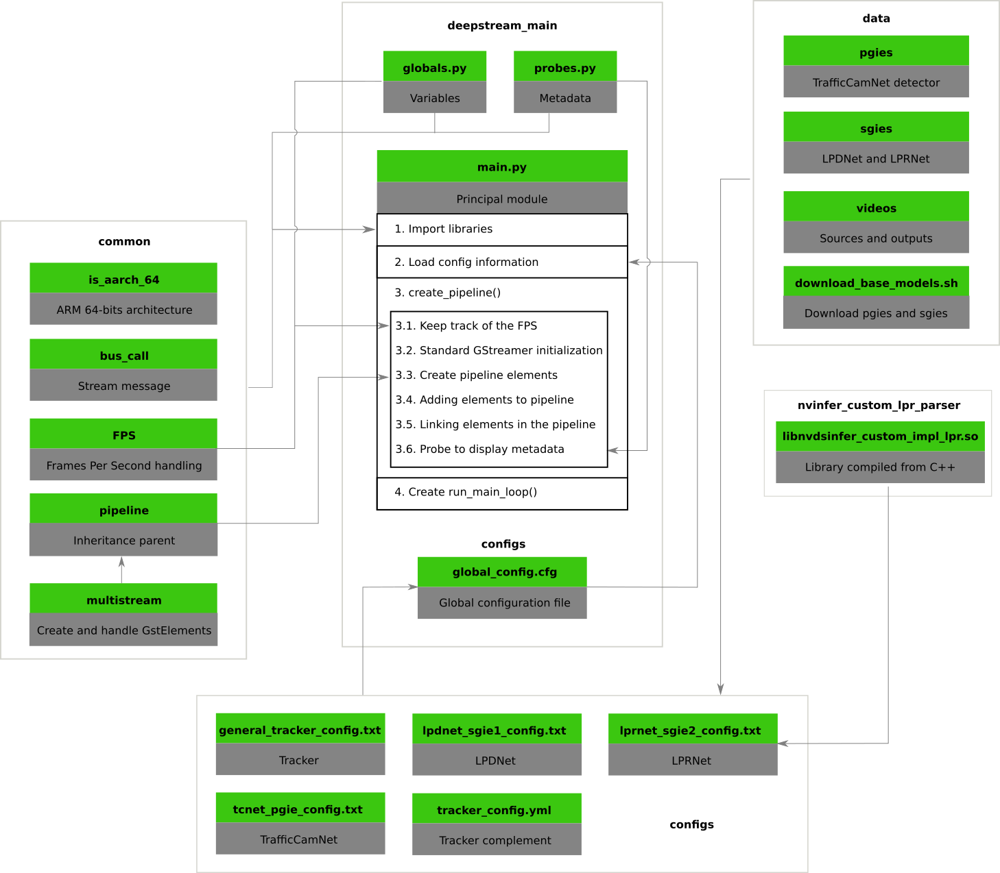

# Main DeepStream Application

## Requirements

1. Complete the steps on [deployment](../README.md) to build the adequate environment for this application.

2. Make sure that the library [`../nvinfer_custom_lpr_parser/libnvdsinfer_custom_impl_lpr.so`](../nvinfer_custom_lpr_parser/libnvdsinfer_custom_impl_lpr.so) is available. That library is useful for parsing the character recognition in a readable format. If that library is not available, please run the Makefile into the folder [`../nvinfer_custom_lpr_parser/`](../nvinfer_custom_lpr_parser/) for compiling the library.

    ```console
    cd ../nvinfer_custom_lpr_parser/ && make && cd ../deepstream-main/
    ```

## Running steps

1. Run the Docker container by running the scrip [`../run_docker_ds.sh`](../run_docker_ds.sh). Check the Bash script for more details.

    ```console
    bash run_docker_ds.sh
    ```

2. Navigate into the workspace to `deepstream-main` directory and run the script [`run_deepstream.sh`](run_deepstream.sh). Also, you can check the Bash script for more details, where the `main.py` script is called adding the `configs/global_config.cfg` as the default configuration file. 

    ```console
    cd deepstream-main/ && bash run_deepstream.sh
    ```

## Structure


## Explanation

The application is formed by three scripts and a configuration file: 
- `main.py` inherits the `Pipeline` class from `common/pipeline.py`, modifies the functions `__init__`, `create_pipeline()` and `run_main_loop()`.
- `globals.py` contains the global variables for the app.
- `probes.py` contains specific functions to handle metadata.
- `configs/global_config.cfg` contains information about the sources, streammux, detection models, tiler and sink. This file communicates with `../configs/` directory, which contains the configuration for all detection models. It should be noted that the config file `lprnet_sgie2_config.txt` set the usage of a compiled library from C++ called `../nvinfer_custom_lpr_parser/libnvdsinfer_custom_impl_lpr.so` and the function `NvDsInferParseCustomNVPlate`.

### main.py

In order to create a new application based on `Pipeline` class we have to modify three methods on `MainDeepStreamPipeline`: `__init__`, `create_pipeline()` and `run_main_loop()`.

#### Imports

The following packages are imported in the `main.py`.

There are four packages from `common` directory:

- `bus_call` streams message.
- `FPS` handles the frame streamming.
- `is_aarch_64` detects the ARM 64-bits architecture.
- `pipeline` inherits as parent to app pipelines.

There is a installed package from repositories:

- `coloredlogs` — Colored terminal output for Python's logging module.

Also, this app uses built-in packages:

- `argparse` — Parser for command-line options, arguments and sub-commands.
- `ctypes` — A foreign function library for Python.
- `gi` — Pure Python GObject Introspection Bindings.
- `logging` — Logging facility for Python.
- `sys` — System-specific parameters and functions.

#### Initialization (__init__)

`main.py` contains the class `MainDeepStreamPipeline`, which inherits the `Pipeline` class from `pipeline` package in order to use their methods to create pluggins and other util functions.

1. Use `super().__init__(*args, **kw)` to read the config file `configs/global_config.cfg`.
2. Check the configured output type: only RTSP protocol or MP4 format. Note that the reading of the configuration file is done from the parent class.
3. Execute `create_pipeline()`.

#### create_pipeline(self)

The function consists in the following steps:

1. Assign FPS per each configured camera using `FPS_STREAMS`, a global variable in the `globals.py` file.
2. Initialize the GObject using `GObject.threads_init()`, `Gst.init(None)` and `Gst.Pipeline()`.
3. As the class is based on `Pipeline`, the app uses their methods to create each element/plugin. In order to do that, we mostly used the following lines: `self._create_<plugin_name>(<parameters>)`. For a detailed view, please check the methods on [`../common/pipeline.py`](../common/pipeline.py) or [`../common/README.md`](../common/README.md).
4. Adding elements to `self.pipeline`.
5. Linking elements through list iterations using the `Pipeline` class too.
6. If necessary, add probes using the function `self.set_probe(plugin, pad_type, function, plugin_name)`. Note that the function attributes must be defined in `probes.py`.

### Probes

`probes.py` to display FPS and get metadata information.
