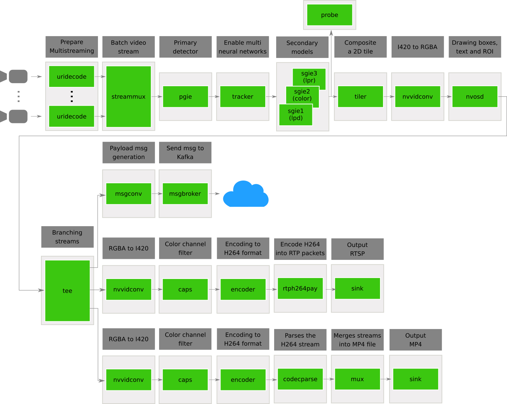

# Main DeepStream Application

This is the main application for our Automatic License Plate Recognition system. The pipeline was developed in such a way that it performs the following actions:

1. Accept multi-sources inputs of two types: videos (in mp4) and video streaming.
2. Contains 4 deep learning models working in a cascade style.
    - **tcnet** detects cars.
    - **lpdnet** detects plates on the previous detected car.
    - **lprnet** recognizes character on the previous detected plate.
    - **colornet** recognize the car color on the previous car detection (from tcnet).

3. Accept two sink outputs (at the same time): MP4 sink and RTSP sink. These sinks can be controled in [./configs/global_config.cfg](./configs/global_config.cfg).
4. Send message payload to a topic in Kafka broker by using two additional plugins (`nvdsmsgconv` , `nvdsmsgbroker`), which can be customized.

## Requirements

1. Complete the steps on [deployment](../README.md) to build the adequate environment for this application.

2. Make sure that the library [`../custom_libraries/nvinfer_custom_lpr_parser/libnvdsinfer_custom_impl_lpr.so`](../custom_libraries/nvinfer_custom_lpr_parser/libnvdsinfer_custom_impl_lpr.so) is available. That library is useful for parsing the character recognition in a readable format. If that library is not available, please run the Makefile into the folder [`../custom_libraries/nvinfer_custom_lpr_parser/`](../custom_libraries/nvinfer_custom_lpr_parser/) for compiling the library.

    ```console
    cd ../custom_libraries/nvinfer_custom_lpr_parser/ && make && cd ../deepstream-main/
    ```
## Dependencies

- DeepStreamSDK 6.0.1
- Python 3.6
- Gst-python
- Kafka:

    ```console
    $ sudo apt-get install libglib2.0 libglib2.0-dev
    $ sudo apt-get install libjansson4  libjansson-dev
    $ sudo apt-get install librdkafka1=0.11.3-1build1
    ```
## Running steps

1. Run the Docker container by running the scrip [`../run_docker_ds.sh`](../run_docker_ds.sh). Check the Bash script for more details.

    ```console
    bash run_docker_ds.sh
    ```
2. For this application, we need a way to see if the application is sending messages to Kafka. In this way, we will use a custom consumer that reads messages from the topic `quickstart-events`. To execute the consumer locally, we need to open the current container in other terminal and run the script `run_consumer.sh`.

    ```console
    docker exec -it mobia-dev /bin/bash
    bash deepstream-main/run_consumer.sh
    ```
    Note that here, we need to point the consumer into a Kafka broker that is already running. However, in this example, we don't need to run the broker locally again because these steps are already set into the [Dockerfile](../Dockerfile) in the section ENTRYPOINT.

2. Navigate into the workspace to `deepstream-main` directory and run the script [`run_deepstream.sh`](run_deepstream.sh). Also, you can check the Bash script for more details, where the `main.py` script is called adding the `configs/global_config.cfg` as the default configuration file. 

    ```console
    cd deepstream-main/ && bash run_deepstream.sh
    ```

4. Enable logging (Optional):
  Go through the README to setup & enable logs for the messaging libraries(kafka, azure, amqp)
    ```console
    $ cat /opt/nvidia/deepstream/deepstream/sources/tools/nvds_logger/README
    ```

## Configuration File

This application contains some additional configuration for sending message to a Kafka broker. Specifically, we add two sections on [./configs/global_config.cfg](./configs/global_config.cfg). These section controls the configuration properties for two additional plugins  `nvmsgconv` and `nvmsgbroker`.

- [nvmsgconv]
  - **config_file**: config file to set static information. The file [configs/dstest4_msgconv_config.txt](./configs/dstest4_msgconv_config.txt) is an example.
  - **schema_type (Default 2)**: choose the schema to send messages. Full: 0, Minimal: 1, Custom: 2. Here, we use a custom message with a new extended obj called: `NvDsCarObject`.
  - **msg2p-lib**: path to the custom library with the custom object. You can find and custom this library in the following route [../custom_libraries/nvmsgconv/](../custom_libraries/nvmsgconv/). Note that in order to use a custom object `NvDsCarObject` in python, you also need to program the custom bindings for python. An example can be found in [../custom_libraries/pyds_custom/pyds_custom.cpp](../custom_libraries/pyds_custom/pyds_custom.cpp).
  - **frame-interval (Default 30)**: period until send a new message to kafka broker. Based on the use cases you will need to set this value to a smaller or bigger value. Note that frame-interval <20 has problems due to the jetson memory capacity.

- [nvmsgbroker]
  - **proto_lib**: set the path of adaptor library. Adaptor library can be found at `/opt/nvidia/deepstream/deepstream-<version>/lib`

    - kafka lib           - libnvds_kafka_proto.so
    - azure device client - libnvds_azure_proto.so
    - AMQP lib            - libnvds_amqp_proto.so

    NOTE: More details about the message adapters can be found at README inside `/opt/nvidia/deepstream/deepstream-<version>/sources/libs/*_protocol_adaptor`

  - **host**: set the host where it is the kafka broker
  - **port**: set the port from where we want to listen the kafka broker
  - **topic**: set the topic from where we want to send messages
  - **cfg-file (optional)**: Additionally, you can set an adaptot configuration file.

    For kafka: use [./configs/cfg_kafka.txt](./configs/cfg_kafka.txt) as a reference. This file is used to define the parition key field to be used while sending messages to the kafka broker. Refer Kafka Protocol Adaptor section in the DeepStream 6.0 Plugin Manual for more details about using this config option. The partition-key setting within the cfg_kafka.txt should be set based on the schema type selected using the --schema option. Set this to
    "sensor.id" in case of Full message schema, and to "sensorId" in case of Minimal message schema

## Structure


## Explanation

The application is formed by three scripts and a configuration file: 
- `main.py` inherits the `Pipeline` class from `common/pipeline.py`, modifies the functions `__init__`, `create_pipeline()` and `run_main_loop()`.
- `globals.py` contains the global variables for the app.
- `probes.py` contains specific functions to handle metadata.
- `configs/global_config.cfg` contains information about the sources, streammux, detection models, tiler and sink. This file communicates with `../configs/` directory, which contains the configuration for all detection models. It should be noted that the config file `lprnet_sgie2_config.txt` set the usage of a compiled library from C++ called `../nvinfer_custom_lpr_parser/libnvdsinfer_custom_impl_lpr.so` and the function `NvDsInferParseCustomNVPlate`.

### `main.py`

In order to create a new application based on `Pipeline` class we have to modify three methods on `MainDeepStreamPipeline`: `__init__`, `create_pipeline()` and `run_main_loop()`.

#### Imports

The following packages are imported in the `main.py`.

There are four packages from `common` directory:

- `bus_call` streams message.
- `FPS` handles the frame streamming.
- `is_aarch_64` detects the ARM 64-bits architecture.
- `pipeline` inherits as parent to app pipelines.

There is a installed package from repositories:

- `coloredlogs` — Colored terminal output for Python's logging module.

Also, this app uses built-in packages:

- `argparse` — Parser for command-line options, arguments and sub-commands.
- `ctypes` — A foreign function library for Python.
- `gi` — Pure Python GObject Introspection Bindings.
- `logging` — Logging facility for Python.
- `sys` — System-specific parameters and functions.

#### Initialization (`__init__`)

`main.py` contains the class `MainDeepStreamPipeline`, which inherits the `Pipeline` class from `pipeline` package in order to use their methods to create pluggins and other util functions.

1. Use `super().__init__(*args, **kw)` to read the config file `configs/global_config.cfg`.
2. Check the configured output type: only RTSP protocol or MP4 format. Note that the reading of the configuration file is done from the parent class.
3. Execute `create_pipeline()`.

#### `create_pipeline(self)`

The function consists in the following steps:

1. Assign FPS per each configured camera using `FPS_STREAMS`, a global variable in the `globals.py` file.
2. Initialize the GObject using `GObject.threads_init()`, `Gst.init(None)` and `Gst.Pipeline()`.
3. As the class is based on `Pipeline`, the app uses their methods to create each element/plugin. In order to do that, we mostly used the following lines: `self._create_<plugin_name>(<parameters>)`. For a detailed view, please check the methods on [`../common/pipeline.py`](../common/pipeline.py) or [`../common/README.md`](../common/README.md).
4. Adding elements to `self.pipeline`.
5. Linking elements through list iterations using the `Pipeline` class too.
6. If necessary, add probes using the function `self.set_probe(plugin, pad_type, function, plugin_name)`. Note that the `function` attribute must be defined in `probes.py`.

##### Structure


### `probes.py`

`probes.py` gets metadata information from inference: pgie and sgie. The probe must be attached to a pad on a plugin. In this application, the probe is attached to the sink pad (the input) of the tiler plugin.

#### Extract Metadata with a GStreamer Probe

The `tiler_sink_pad_buffer_probe(pad, info, u_data)` is a callback that executes each time there is new frame data on the sink pad. With this probe, we can extract a snapshot of the metadata coming into the tiler plugin. The metadata structure is shown in the following diagram:


The `NvDsBatchMeta` is a DeepStream structure with the metadata from the GStreamer buffer and further identifies the `frame_meta_list` to iterate through frames. Each frame is casted to `NvDsFrameMeta` and include object metadata list. In the same way, objects are casted to `NvDsObjectMeta` to access information about classification. 

#### Display Frame Information through MetaData

A `display_meta` object of type `NvDsDisplayMeta` is allocated to be copied later into `frame_meta`.  The text element of `display_meta` is set as the `py_nvosd_text_params` variable, of structure `NvOSD_TextParams`, with the following elements:

- **display_text** – *str*, Holds the text to be overlaid.
- **x_offset** – *int*, Holds horizontal offset w.r.t top left pixel of the frame.
- **y_offset** – *int*, Holds vertical offset w.r.t top left pixel of the frame.
- **font_params** – `NvOSD_FontParams`, Holds the font parameters of the text to be overlaid.
- **set_bg_clr** – *int*, Boolean to indicate text has background color.
- **text_bg_clr** – `NvOSD_ColorParams`, Holds the text’s background color, if specified.

The [DeepStream Python API Reference](https://docs.nvidia.com/metropolis/deepstream/python-api/index.html) provides details for all of the metadata structure properties and methods.