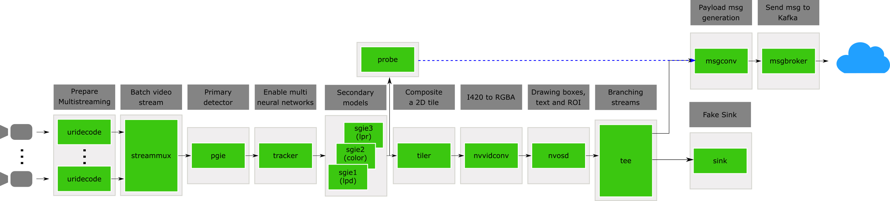

# Message to Kafka DeepStream Application

This sample is based on the diagram bellow to demonstrate:

* Use **"nvmsgconv"** and **"nvmsgbroker"** plugins in the pipeline.
* Create `NVDS_META_EVENT_MSG` type of meta and attach to buffer.
* Use `NVDS_META_EVENT_MSG for` a custom object `NvDsCarObject`.
* Provide copy / free functions if meta data is extended through "extMsg" field.



**"nvmsgconv"** plugin uses `NVDS_META_EVENT_MSG` type of metadata from the buffer
and generates the "DeepStream Schema" payload in Json format. Static properties
of schema are read from configuration file in the form of key-value pair.
Check [./configs/dstest4_msgconv_config.txt](./configs/dstest4_msgconv_config.txt) for reference. 
Generated payload is attached as `NVDS_META_PAYLOAD` type metadata to the buffer.

**"nvmsgbroker"** plugin extracts `NVDS_META_PAYLOAD` type of metadata from the buffer
and sends that payload to the server using protocol adaptor APIs.

Generating custom metadata for different type of objects:
In addition to common fields provided in `NvDsEventMsgMeta` structure, user can
also create custom objects and attach to buffer as `NVDS_META_EVENT_MSG` metadata.
To do that `NvDsEventMsgMeta` provides "extMsg" and "extMsgSize" fields. User can
create custom structure, fill that structure and assign the pointer of that
structure as "extMsg" and set the "extMsgSize" accordingly.
If custom object contains fields that can't be simply mem copied then user should
also provide function to copy and free those objects.

Refer `generate_event_msg_meta()` to know how to use "extMsg" and "extMsgSize"
fields for custom objects and how to provide copy/free function and attach that
object to buffer as metadata.


## Requirements

1. Complete the steps on [deployment](../README.md) to build the adequate environment for this application.

2. Make sure that the library [`../custom_libraries/nvinfer_custom_lpr_parser/libnvdsinfer_custom_impl_lpr.so`](../custom_libraries/nvinfer_custom_lpr_parser/libnvdsinfer_custom_impl_lpr.so) is available. That library is useful for parsing the character recognition in a readable format. If that library is not available, please run the Makefile into the folder [`../custom_libraries/nvinfer_custom_lpr_parser/`](../custom_libraries/nvinfer_custom_lpr_parser/) for compiling the library.

    ```console
    cd ../nvinfer_custom_lpr_parser/ && make && cd ../deepstream-main/
    ```
## Dependencies

- DeepStreamSDK 6.0.1
- Python 3.6
- Gst-python
- Kafka:

    ```console
    $ sudo apt-get install libglib2.0 libglib2.0-dev
    $ sudo apt-get install libjansson4  libjansson-dev
    $ sudo apt-get install librdkafka1=0.11.3-1build1
    ```
## Running steps

1. Run the Docker container by running the script [`../run_docker_ds.sh`](../run_docker_ds.sh). Check the Bash script for more details.

    ```console
    bash run_docker_ds.sh
    ```

2. For this application, we need a way to see if the application is sending messages to Kafka. In this way, we will use a custom consumer that reads messages from the topic `deepstream-msg2kafka`. To execute the consumer locally, we need to open the current container in other terminal and run the script `run_consumer.sh`.

    ```console
    docker exec -it mobia-dev /bin/bash
    bash deepstream-msg2kafka/run_consumer.sh
    ```
    Note that here, we need to point the consumer into a Kafka broker that is already running. We don't need to run the broker here because these steps are already set into the [Dockerfile](../Dockerfile) in the section ENTRYPOINT.

3. Navigate into the workspace to `deepstream-msg2kafka` directory and run the script [`run_deepstream.sh`](run_deepstream.sh). Also, you can check the Bash script for more details, where the `main.py` script is called adding the `configs/global_config.cfg` as the default configuration file. 

    ```console
    cd deepstream-msg2kafka/ && bash run_deepstream.sh
    ```

4. Enable logging (Optional):
  Go through the README to setup & enable logs for the messaging libraries(kafka, azure, amqp)
    ```console
    $ cat /opt/nvidia/deepstream/deepstream/sources/tools/nvds_logger/README
    ```

## Configuration file

This application contains some additional configuration for sending message to a Kafka broker. Specifically, we add two sections on [./configs/global_config.cfg](./configs/global_config.cfg). These section controls the configuration properties for two additional plugins  `nvmsgconv` and `nvmsgbroker`.

- [nvmsgconv]
  - **config_file**: config file to set static information. The file [configs/dstest4_msgconv_config.txt](./configs/dstest4_msgconv_config.txt) is an example.
  - **schema_type (Default 2)**: choose the schema to send messages. Full: 0, Minimal: 1, Custom: 2. Here, we use a custom message with a new extended obj called: `NvDsCarObject`.
  - **msg2p-lib**: path to the custom library with the custom object. You can find and custom this library in the following route [../custom_libraries/nvmsgconv/](../custom_libraries/nvmsgconv/). Note that in order to use a custom object `NvDsCarObject` in python, you also need to program the custom bindings for python. An example can be found in [../custom_libraries/pyds_custom/pyds_custom.cpp](../custom_libraries/pyds_custom/pyds_custom.cpp).
  - **frame-interval (Default 30)**: period until send a new message to kafka broker. Based on the use cases you will need to set this value to a smaller or bigger value. Note that frame-interval <20 has problems due to the jetson memory capacity.

- [nvmsgbroker]
  - **proto_lib**: set the path of adaptor library. Adaptor library can be found at `/opt/nvidia/deepstream/deepstream-<version>/lib`

    - kafka lib           - libnvds_kafka_proto.so
    - azure device client - libnvds_azure_proto.so
    - AMQP lib            - libnvds_amqp_proto.so

    NOTE: More details about the message adapters can be found at README inside `/opt/nvidia/deepstream/deepstream-<version>/sources/libs/*_protocol_adaptor`

  - **host**: set the host where it is the kafka broker
  - **port**: set the port from where we want to listen the kafka broker
  - **topic**: set the topic from where we want to send messages
  - **cfg-file (optional)**: Additionally, you can set an adaptot configuration file.

    For kafka: use [./configs/cfg_kafka.txt](./configs/cfg_kafka.txt) as a reference. This file is used to define the parition key field to be used while sending messages to the kafka broker. Refer Kafka Protocol Adaptor section in the DeepStream 6.0 Plugin Manual for more details about using this config option. The partition-key setting within the cfg_kafka.txt should be set based on the schema type selected using the --schema option. Set this to
    "sensor.id" in case of Full message schema, and to "sensorId" in case of Minimal message schema

