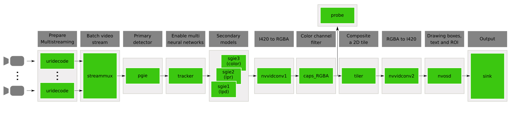

# Video to Data DeepStream Application

## Introduction

This DeepStream application help us to extract frames from videos where there are correct detections, which guarantees is certain degree that the frame contains a car/plate. To the detection, we used the base models to demonstrate how to:

* Access imagedata in a multistream source
* Modify the images in-place. Changes made to the buffer will reflect in the downstream but color format, resolution and numpy transpose operations are not permitted.  
* Make a copy of the image, modify it and save to a file. These changes are made on the copy of the image and will not be seen downstream.
* Extract the stream metadata, imagedata, which contains useful information about the
  frames in the batched buffer.
* Annotating detected objects within certain confidence interval
* Use OpenCV to draw bboxes on the image and save it to file.
* Use multiple sources in the pipeline.
* Use a uridecodebin so that any type of input (e.g. RTSP/File), any GStreamer
  supported container format, and any codec can be used as input.
* Configure the stream-muxer to generate a batch of frames and infer on the
  batch for better resource utilization.

NOTE:
- For x86, only CUDA unified memory is supported.
- Only RGBA color format is supported for access from Python. Color conversion
  is added in the pipeline for this reason.

This application is based on the following diagram:



## Prerequisites

The following software is already installed in the Docker container:
- DeepStreamSDK 6.0.1
- Python 3.6
- Gst-python
- NumPy package
- OpenCV package

If you want to install required packages (last two) for any reason, run the following CLI command:

```bash
sudo apt update
sudo apt install python3-numpy python3-opencv -y
```

## Requirements

1. Complete the steps on [deployment](../README.md) to build the adequate environment for this application.

2. Make sure that the library [`../custom_libraries/nvinfer_custom_lpr_parser/libnvdsinfer_custom_impl_lpr.so`](../custom_libraries/nvinfer_custom_lpr_parser/libnvdsinfer_custom_impl_lpr.so) is available. That library is useful for parsing the character recognition in a readable format. If that library is not available, please run the Makefile into the folder [`../custom_libraries/nvinfer_custom_lpr_parser/`](../custom_libraries/nvinfer_custom_lpr_parser/) for compiling the library.

    ```console
    cd ../nvinfer_custom_lpr_parser/ && make && cd ../deepstream-main/
    ```

## Running steps

1. Run the Docker container by running the scrip [`../run_docker_ds.sh`](../run_docker_ds.sh). Check the Bash script for more details.

    ```console
    bash run_docker_ds.sh
    ```

2. Navigate into the workspace to `deepstream-main` directory and run the script [`run_deepstream.sh`](run_deepstream.sh). Also, you can check the Bash script for more details, where the `main.py` script is called adding the `configs/global_config.cfg` as the default configuration file. 

    ```console
    cd deepstream-main/ && bash run_deepstream.sh
    ```

3. Enable logging (Optional):
  Go through the README to setup & enable logs for the messaging libraries(kafka, azure, amqp)
    ```console
    $ cat /opt/nvidia/deepstream/deepstream/sources/tools/nvds_logger/README
    ```

## Configuration File

The configuration file `configs/global_config.cfg` is based on the main app configuration file and differs from it by having one more section `[video2data]`. The key names in this section are the following:

- **output_folder** – *str*, Directory to save the frames.
- **period_per_save** – *int*, Period of frames in which the information is stored.
- **min_confidence_car** – *float*, Minimal confidence to save car image. Accepted values are between 0,0 and 1,0.
- **min_confidence_plate** – *float*, Minimal confidence to save license plate image. Accepted values are between 0,0 and 1,0.
- **min_confidence_characters** – *float*, Minimal confidence to save image with license plate characters. Accepted values are between 0,0 and 1,0.
- **save_labeled_copy** – *int*, Flag to save or not a labeled copy of image. Accepted values are 0 or 1.
- **save_with_date_time** – *int*, Flag to save or not image with date and time information. Accepted values are 0 or 1.

## How to save the metadata into images, crops and annotations.

`probes.py` gets metadata information from inference: pgie and sgie. The probe must be attached to a pad on a plugin. In this application, the probe is attached to the sink pad (the input) of the tiler plugin.

### Extract Metadata with a GStreamer Probe

The `tiler_sink_pad_buffer_probe(video2data_attribs)` function use `auxiliar_func(pad, info, u_data)` as a callback that executes each time there is new frame data on the sink pad. The `video2data_attribs` come from `[video2data]` section of `configs/global_config.cfg`. With this probe, we can extract a snapshot of the metadata coming into the tiler plugin. For more information about metadata structure, check the [`README.md`](../deepstream-main/README.md) of the main application.

### Saving Data and Annotation per Period

Inside `auxiliar_func(pad, info, u_data)` there is a checker of the frame number. If this number is a period of `period_per_save`, then we proceed to save information using `extract_save_data` function. This function makes the following actions:

1. Extract the frame data using the [`get_nvds_buf_surface`](https://docs.nvidia.com/metropolis/deepstream/python-api/PYTHON_API/Methods/methodsdoc.html?highlight=get_nvds_buf_surface#pyds.get_nvds_buf_surface) method.
2. Convert to NumPy format and then to OpenCV. If applicable, copy the result to draw bounding boxes and check detections.
3. If the object is a car or a plate with a higher confidence that a threshold, save the annotation in a specific format with respect to the current frame in a file.
4. Additionally, if the object is a plate, check the classification of this object. If the confidence is higher than the threshold, then we save the crop of the plate and  its label (characters).
5. If applicable, save information of the current frame (frame_img, crops and annotations) from the previous collected information.

The [DeepStream Python API Reference](https://docs.nvidia.com/metropolis/deepstream/python-api/index.html) provides details for all of the metadata structure properties and methods.